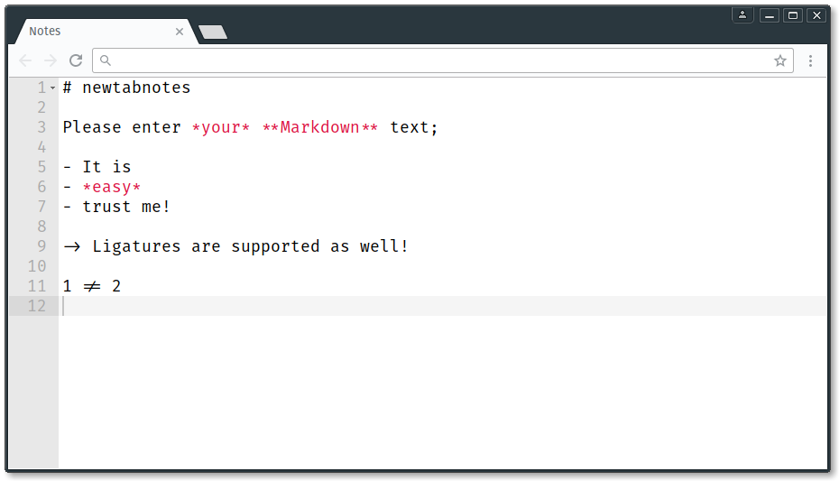

# newtabnotes

`newtabnotes` is a chrome extension that overwrites the default newtab page with an editor window.

## TODO

- [ ] add settings bar with the following options:
	- color-scheme
	- font-size
	- syntax
- [x] use local-storage to save editor content
